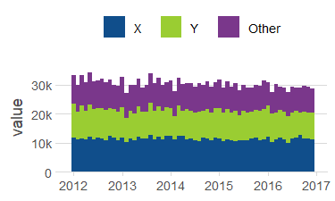
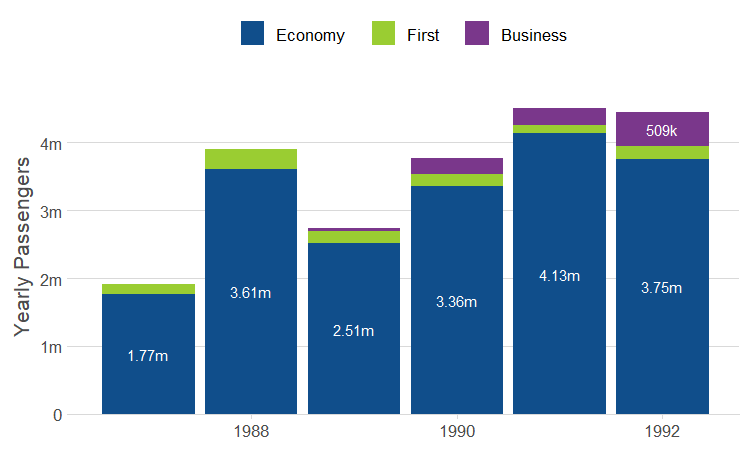
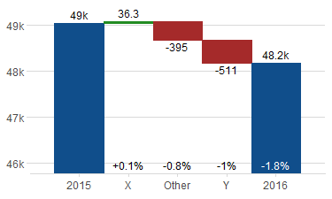
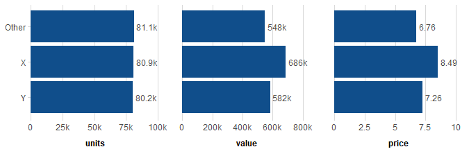

[](https://codecov.io/github/wkostelecki/ezplot?branch=master)
[](https://cran.r-project.org/package=ezplot)
[](https://travis-ci.org/wkostelecki/ezplot)

## Overview
ezplot provides high-level wrapper functions for common chart types with reduced typing and easy faceting:
- `line_plot()`
- `area_plot()`
- `bar_plot()`
- `tile_plot()`
- `waterfall_plot()`
- `side_plot()`

## Intallation
devtools::install_github("wkostelecki/ezplot")

## Example data
``` r
library(ezplot)
df = ez_data()
summary(df)

#>     char              fct            num          day                  week                month                 year          year2          units            value       
#> Length:21924       X    :7308   Min.   :10   Min.   :2012-01-01   Min.   :2012-01-01   Min.   :2012-01-01   Min.   :2012   Min.   :2012   Min.   : 2.383   Min.   : 14.30  
#> Class :character   Y    :7308   1st Qu.:10   1st Qu.:2013-04-01   1st Qu.:2013-03-31   1st Qu.:2013-04-01   1st Qu.:2013   1st Qu.:2013   1st Qu.: 8.420   1st Qu.: 57.94  
#> Mode  :character   Other:7308   Median :15   Median :2014-07-02   Median :2014-06-29   Median :2014-07-01   Median :2014   Median :2014   Median :11.018   Median : 76.32  
#>                                 Mean   :15   Mean   :2014-07-02   Mean   :2014-06-29   Mean   :2014-06-17   Mean   :2014   Mean   :2014   Mean   :10.991   Mean   : 78.29  
#>                                 3rd Qu.:20   3rd Qu.:2015-10-02   3rd Qu.:2015-09-27   3rd Qu.:2015-10-01   3rd Qu.:2015   3rd Qu.:2016   3rd Qu.:13.507   3rd Qu.: 96.27  
#>                                 Max.   :20   Max.   :2016-12-31   Max.   :2016-12-25   Max.   :2016-12-01   Max.   :2016   Max.   :2017   Max.   :19.656   Max.   :190.04  

```
## Usage
### line_plot
<!-- -->
``` r
# plot value sales with "year2" aggregation along x-axis
line_plot(df, x = "year2", y = "value")
line_plot(df, x = "year2", y = "value", group = "fct") # adds "fct" grouping

# add "fct" faceting with facet_wrap()
line_plot(df, x = "year2", y = "value", group = "num", facet_x = "fct")

# add "fct" and "char" faceting with facet_grid()
line_plot(df, x = "year2", y = "value", group = "num",
          facet_x = "fct", facet_y = "char")
```

### area_plot (stacked area)
<!-- -->
``` r
# plot value sales with "year2" aggregation along x-axis
area_plot(df, "year2", "value")
area_plot(df, "year2", "value", "num") # adds "num" grouping
area_plot(df, "year2", "value", "num", "fct") # add "fct" faceting with facet_wrap().
area_plot(df, "year2", "value", "num", "fct", "char") # add "fct" and "char" faceting with facet_grid().
```

### bar_plot
<!-- -->
``` r
# plot value sales with "year2" aggregation along x-axis
bar_plot(df, x = "year", y = "value")
bar_plot(df, x = "year", y = "value", group = "fct") # adds "fct" grouping
```

### tile_plot
``` r
tile_plot(df, "year", "char", "value")
tile_plot(df, "year", "char", "value", "fct", "num")
```

### waterfall_plot
<!-- -->
```r
waterfall_plot(df, "year", "value", "fct")
```

### side_plot
<!-- -->
```r
side_plot(df, "fct", c("units", "value", price = "~ value / units"))
```
