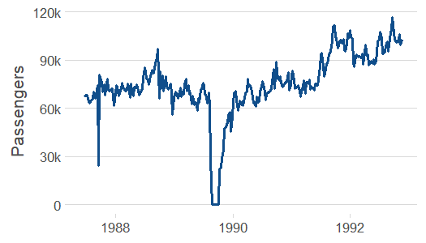
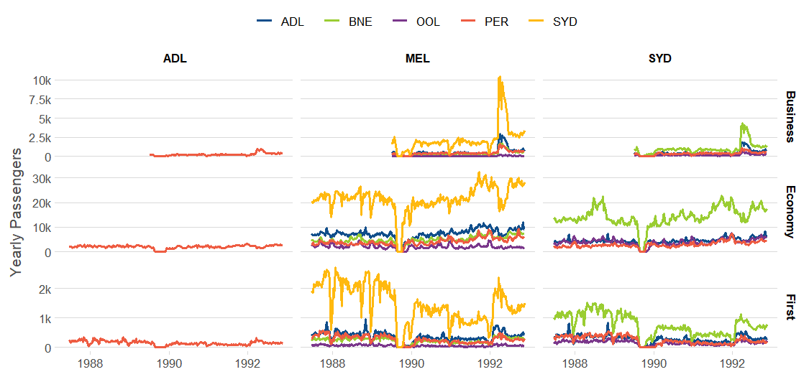
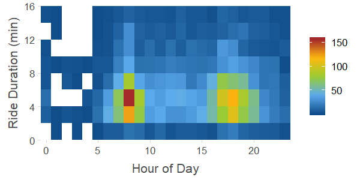
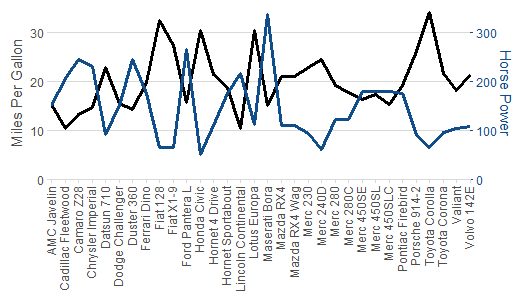

# ezplot

<!-- badges: start -->
[](https://codecov.io/github/wkostelecki/ezplot?branch=master)
[](https://cran.r-project.org/package=ezplot)
[](https://travis-ci.org/wkostelecki/ezplot)
[](http://www.r-pkg.org/pkg/ezplot)
[](http://www.r-pkg.org/pkg/ezplot)
<!-- badges: end -->

## Installation

You can install the released version of ezplot from [CRAN](https://CRAN.R-project.org) with:

``` r
install.packages("ezplot")
```

... or the latest stable Github version with: 

``` r
devtools::install_github("wkostelecki/ezplot")
```

## Overview

ezplot provides high-level wrapper functions for common chart types with reduced typing and easy faceting. e.g.:
- `line_plot()`
- `area_plot()`
- `bar_plot()`
- `tile_plot()`
- `waterfall_plot()`
- `side_plot()`
- `secondary_plot()`

``` r
library(ezplot)
library(tsibbledata)
```
## Usage
### line_plot
``` r
line_plot(ansett, x = "Week", y = "Passengers") # weekly aggregate "Passengers"
```
<!-- -->
``` r
# Other examples:
line_plot(ansett, x = "Week", y = "Passengers", group = "Airports") # adds "Airports" grouping
line_plot(ansett, x = "Week", y = "Passengers", group = "Airports", facet_x = "Class") # facet by "Class"
```

``` r
# with group and two facets:
line_plot(ansett, x = "Week",
          y = c("Yearly Passengers" = "Passengers"),
          group = "substr(Airports, 5, 7)",
          facet_x = "substr(Airports, 1, 3)", facet_y = "Class",
          facet_scales = "free_y")
```
<!-- -->

### area_plot (stacked area)
``` r
area_plot(ansett, x = "Week", y = "Passengers")
area_plot(ansett, x = "Week", y = c("Weekly Passengers" = "Passengers"), "Class")
```

``` r
# Other examples:
area_plot(ansett, "Week", "Passengers", "Class")
area_plot(df, "year2", "value", "num", "fct") # add "fct" faceting with facet_wrap().
area_plot(df, "year2", "value", "num", "fct", "char") # add "fct" and "char" faceting with facet_grid().
```
<!-- -->

### bar_plot
``` r
bar_plot(ansett, x = "lubridate::year(Week)", y = "Passengers")
bar_plot(ansett, x = "lubridate::year(Week)",
         y = c("Yearly Passengers" = "Passengers"), "Class")

```
<!-- -->

### tile_plot
``` r
nyc_bikes %>% 
  mutate(duration = as.numeric(stop_time - start_time)) %>% 
  filter(between(duration, 0, 16)) %>% 
  tile_plot(c("Hour of Day" = "lubridate::hour(start_time)"),
            c("Ride Duration (min)" = "duration - duration %% 2 + 1"))
```
<!-- -->


### waterfall_plot
```r
waterfall_plot(df, "year", "value", "fct")
```
<!-- -->

### side_plot
```r
side_plot(df, "fct", c("units", "value", price = "~ value / units"))
```
<!-- -->

### secondary_plot
Plot with secondary y-axis.
```r
secondary_plot(mtcars, "row.names(mtcars)",
                      c("Miles Per Gallon" = "mpg"), c("Horse Power" = "hp"),
                      ylim1 = c(0, 35),
                      ylim2 = c(0, 350))
```
<!-- -->
