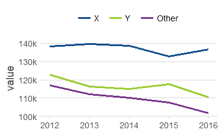

## Overview
ezplot provides high-level wrapper functions for common chart types with easy faceting:
- `line_plot()`
- `tile_plot()`

<!-- -->

## Intallation
devtools::install_github("wkostelecki/ezplot")

## Example data
``` r
library(ezplot)
df = ez_data()
summary(df)

#>     char              fct            num          day                  week                month                 year          year2          units            value       
#> Length:21924       X    :7308   Min.   :10   Min.   :2012-01-01   Min.   :2012-01-01   Min.   :2012-01-01   Min.   :2012   Min.   :2012   Min.   : 2.383   Min.   : 14.30  
#> Class :character   Y    :7308   1st Qu.:10   1st Qu.:2013-04-01   1st Qu.:2013-03-31   1st Qu.:2013-04-01   1st Qu.:2013   1st Qu.:2013   1st Qu.: 8.420   1st Qu.: 57.94  
#> Mode  :character   Other:7308   Median :15   Median :2014-07-02   Median :2014-06-29   Median :2014-07-01   Median :2014   Median :2014   Median :11.018   Median : 76.32  
#>                                 Mean   :15   Mean   :2014-07-02   Mean   :2014-06-29   Mean   :2014-06-17   Mean   :2014   Mean   :2014   Mean   :10.991   Mean   : 78.29  
#>                                 3rd Qu.:20   3rd Qu.:2015-10-02   3rd Qu.:2015-09-27   3rd Qu.:2015-10-01   3rd Qu.:2015   3rd Qu.:2016   3rd Qu.:13.507   3rd Qu.: 96.27  
#>                                 Max.   :20   Max.   :2016-12-31   Max.   :2016-12-25   Max.   :2016-12-01   Max.   :2016   Max.   :2017   Max.   :19.656   Max.   :190.04  

```
## Usage
### line_plot
``` r
# plot unit sales with "year2" aggregation along x-axis
line_plot(df, "year2", "units")
line_plot(df, "year2", "units", "num") # adds "num" grouping
line_plot(df, "year2", "units", "num", "fct") # add "fct" faceting with facet_wrap().
line_plot(df, "year2", "units", "num", "fct", "char") # add "fct" and "char" faceting with facet_grid().
```

### tile_plot
``` r
tile_plot(df, "year", "char", "value")
tile_plot(df, "year", "char", "value", "fct", "num")
```
