<!-- README.md is generated from README.Rmd. Please edit that file -->

# ezplot

<!-- badges: start -->

[](https://codecov.io/github/wkostelecki/ezplot?branch=master)
[](https://cran.r-project.org/package=ezplot)
[](https://travis-ci.org/wkostelecki/ezplot)
[](http://www.r-pkg.org/pkg/ezplot)
[](http://www.r-pkg.org/pkg/ezplot)
[](https://www.tidyverse.org/lifecycle/#maturing)
<!-- badges: end -->

## Overview

ezplot provides high-level wrapper functions for common chart types with
reduced typing and easy faceting. e.g.:

  - `line_plot()`
  - `area_plot()`
  - `bar_plot()`
  - `tile_plot()`
  - `waterfall_plot()`
  - `side_plot()`
  - `secondary_plot()`

## Installation

You can install the released version of ezplot from
[CRAN](https://CRAN.R-project.org) with:

``` r
install.packages("ezplot")
```

And the development version from [GitHub](https://github.com/) with:

``` r
# install.packages("devtools")
devtools::install_github("wkostelecki/ezplot")
```

## Usage

``` r
library(ezplot)
library(tsibble)
library(tsibbledata)
suppressPackageStartupMessages(library(dplyr))
suppressPackageStartupMessages(library(lubridate))
suppressPackageStartupMessages(library(ggplot2))
library(patchwork)
suppressPackageStartupMessages(library(ROCR, warn.conflicts = FALSE))
```

### line\_plot

Weekly aggregation:

``` r
line_plot(ansett, x = "Week", y = "Passengers")
```

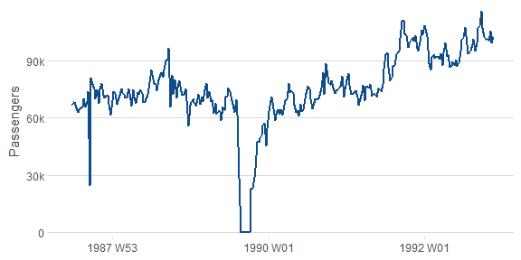

Add grouping:

``` r
line_plot(ansett, x = "Week", y = "Passengers", group = "Class")
```

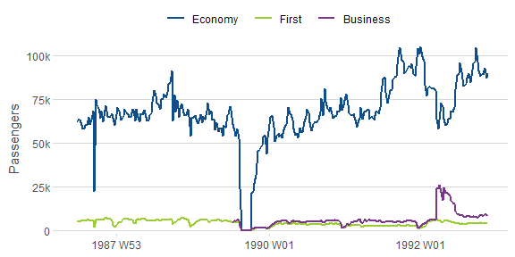

Add faceting:

``` r
line_plot(ansett, x = "Week", y = "Passengers",
          group = "Class", facet_x = "Airports",
          facet_scales = "free_y") +
  theme(axis.text.x = element_text(angle = 90, vjust = 0.38, hjust = 1))
```

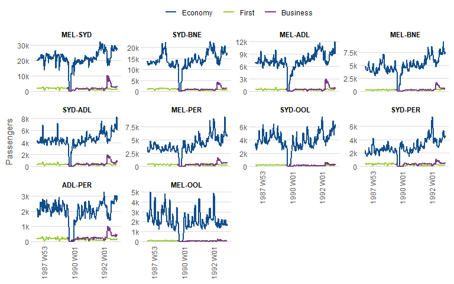

Plot YOY comparisons:

``` r
line_plot(gafa_stock, "Date", c("Closing Stock Price" = "Close"),
          facet_y = "Symbol",
          facet_scales = "free_y",
          yoy = TRUE,
          labels = function(x) ez_labels(x, prepend = "$"))
```


Plot multiple numeric columns:

``` r
line_plot(hh_budget,
          "Year",
          c("DI", "Expenditure", "Savings"),
          facet_x = "Country") +
  theme(panel.spacing.x = unit(1, "lines")) +
  ylab(NULL)
```

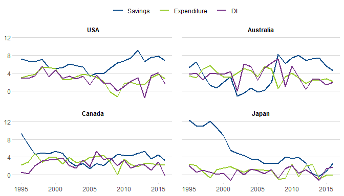

### area\_plot

Weekly aggregation:

``` r
area_plot(ansett, x = "Week", y = "Passengers")
```

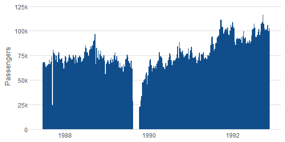

Add grouping:

``` r
area_plot(ansett, x = "Week",
          y = c("Weekly Passengers" = "Passengers"),
          "Class")
```

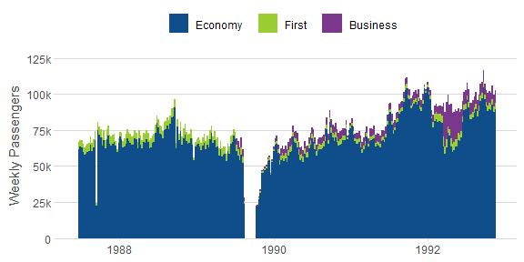

Add faceting:

``` r
area_plot(ansett,
          "year(Week) + (month(Week) - 1) / 12",
          y = c("Monthly Passengers" = "Passengers"),
          group = "substr(Airports, 5, 7)",
          facet_x = "substr(Airports, 1, 3)", facet_y = "Class",
          facet_scales = "free_y") +
          theme(axis.text.x = element_text(angle = 90, vjust = 0.38, hjust = 1))
```

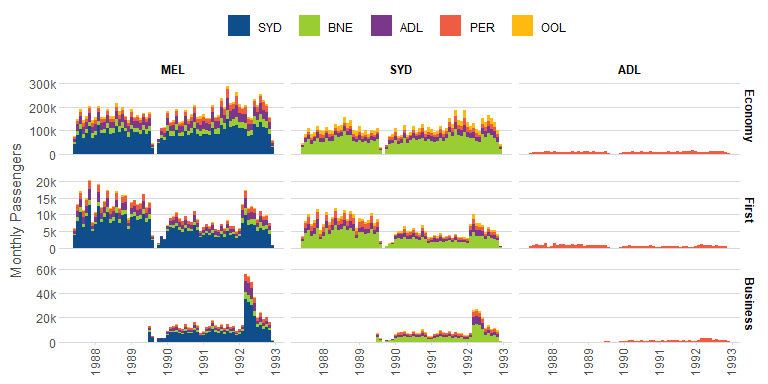

### bar\_plot

Yearly aggregation:

``` r
bar_plot(subset(aus_retail, year(Month) >= 2010),
         x = "year(Month)",
         y = "Turnover")
```

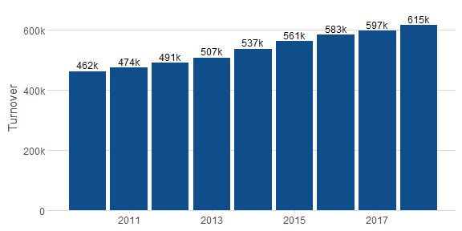

With grouping:

``` r
bar_plot(subset(aus_retail, year(Month) >= 2010), 
         x = "year(Month)",
         y = "Turnover",
         group = "State")
```

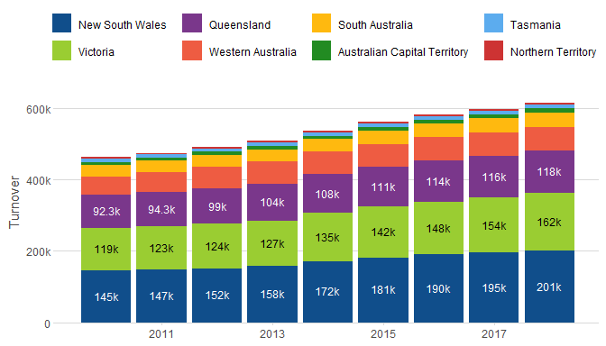
Share of turnover:

``` r
bar_plot(subset(aus_retail, year(Month) >= 2010), 
         x = "year(Month)",
         y = "Turnover",
         group = "State",
         position = "fill")
```

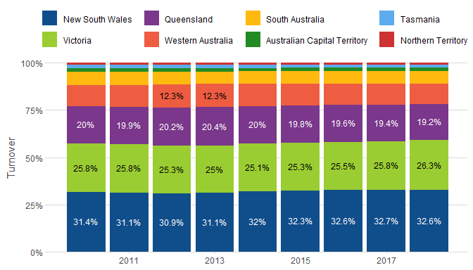

### tile\_plot

``` r
nyc_bikes %>%
  mutate(duration = as.numeric(stop_time - start_time)) %>%
  filter(between(duration, 0, 16)) %>%
  tile_plot(c("Trip Start (Hour of Day)" = "lubridate::hour(start_time) + 0.5"),
            c("Ride Duration (min)" = "duration - duration %% 2 + 1"))
```


``` r
tile_plot(vic_elec,
          c("Temperature (C)" = "round(Temperature)"), 
          c("Half-Hourly Demand (MW)" = "round(Demand, -2)"),
          labels_y = ez_labels, facet_x = "year(Time)")
```

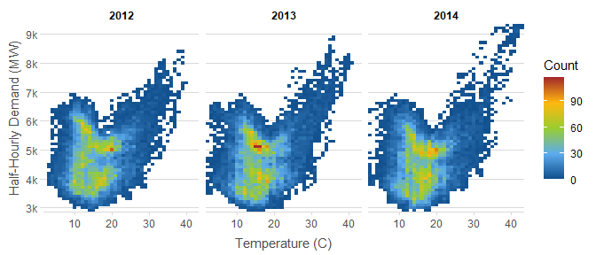

### waterfall\_plot

``` r
waterfall_plot(aus_retail,
               "lubridate::year(Month)",
               "Turnover", 
               "sub(' Territory', '\nTerritory', State)", 
               rotate_xlabel = TRUE)
```

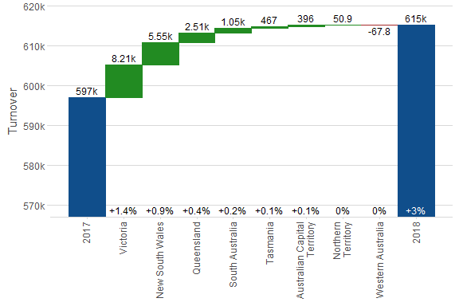

### side\_plot

``` r
side_plot(PBS, 
          "paste(Concession, Type, sep = ' - ')", 
          c("Scripts", "Cost", "Average Cost" = "~ Cost / Scripts"))
```

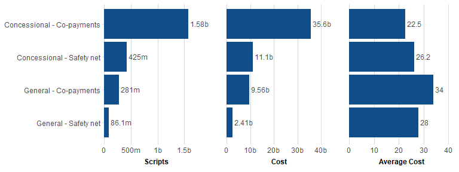

### secondary\_plot

Plot with secondary y-axis.

``` r
secondary_plot(pelt, "Year",
               c("Hare Population" = "Hare"), c("Lynx Population" = "Lynx"),
               ylim1 = c(0, 160e3),
               ylim2 = c(0, 80e3))
```

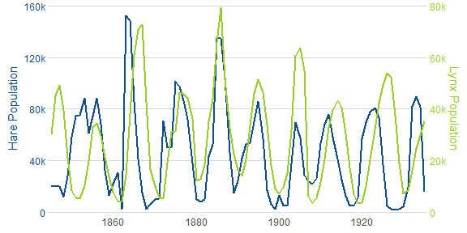

### density\_plot

``` r
nyc_bikes %>% 
  mutate(duration = as.numeric(stop_time - start_time)) %>%
  density_plot(c("time of day" = "as.numeric(start_time) %% 86400 / 60 / 60"),
               group = "ifelse(wday(start_time) %in% c(1, 7), 'week end', 'week day')")
```

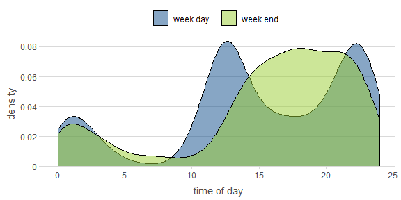

### histogram\_plot

``` r
nyc_bikes %>% 
  mutate(duration = as.numeric(stop_time - start_time)) %>%
  histogram_plot(c("time of day" = "as.numeric(start_time) %% 86400 / 60 / 60"),
                 "density",
                 group = "ifelse(wday(start_time) %in% c(1, 7), 'week end', 'week day')",
                 position = "identity",
                 bins = 48)
```

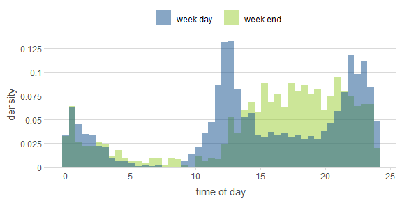

### Classification data

``` r
data(ROCR.simple)
df = data.frame(pred = ROCR.simple$predictions,
                lab = ROCR.simple$labels)
set.seed(4)
```

### roc\_plot

``` r
set.seed(4)
roc_plot(df, "pred", "lab") + 
  roc_plot(df, "pred", "lab", group = "sample(c(0, 1), n(), replace = TRUE)")
```

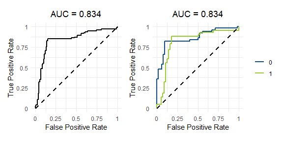

### pr\_plot

Precision-Recall plot

``` r
set.seed(4)
pr_plot(df, "pred", "lab") +
  pr_plot(df, "pred", "lab", group = "sample(c(0, 1), n(), replace = TRUE)")
```

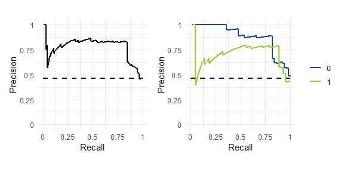

### lift\_plot

``` r
set.seed(4)
performance_plot(df, "pred", "lab", x = "rpp", y = "lift") +
  performance_plot(df, "pred", "lab", group = "sample(c(0, 1), n(), replace = TRUE)", x = "rpp", y = "lift")
```

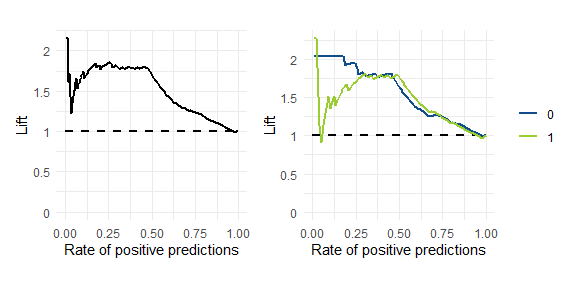
